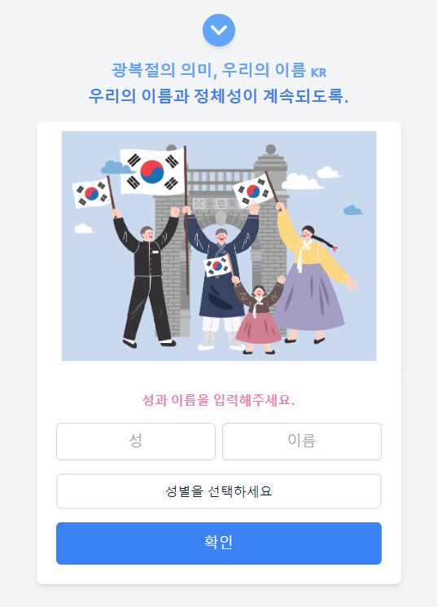
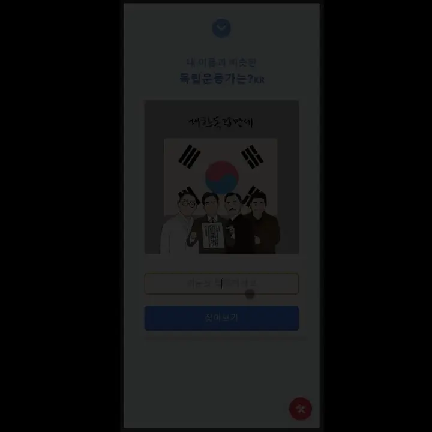

<h1 style="text-align: center;"> 당신의 이름은 8.15 </h1>
<p style="text-align: center;">
   
</p>

# Table of Contents

- [[1] About the Project](#1-about-the-project)
    - [Features](#features)
    - [Technologies](#technologies)
- [[2] Getting Started](#2-getting-started)
- [[3] Trouble Shooting](#3-trouble-shooting)
- [[4] Contribution](#4-contribution)
- [[5] Acknowledgement](#5-acknowledgement)
- [[6] Contact](#6-contact)
- [[7] License](#7-license)

# [1] About the Project

### 프로젝트의 비전

- [내가춘자라니](https://chunja.vercel.app/) 프로젝트에 감명을 받아 제작하였습니다.
- 광복이라는 주제로 우리가 우리이름이 아닌 일본식 성과 이름을 사용할 수밖에 없었을 비극적 역사에서 <br />광복의 의미를 되새기고 싶었습니다.
- 또한 잊혀진 광복의 독립투사들을 자신의 이름에서 찾아내고 기릴 수 있는 시간이 되었으면 했습니다.

## Features

 

### 이름 입력 및 변환

- 사용자가 이름을 입력하면, `useEffect`를 사용하여 한자 데이터를 필터링하고, 입력된 이름에 해당하는 한자 옵션을 제공합니다.

### 좋아요 기능

- 좋아요 버튼은 `fetch`를 사용하여 API 서버와 통신하여 좋아요 수를 업데이트하고, 사용자에게 현재 좋아요 수를 표시합니다.

### 모달 팝업

- 입력 검증 후 사용자에게 오류 메시지를 표시하기 위해 모달 창이 사용됩니다. 모달은 `useState`로 상태를 관리하여 열리고 닫힙니다.

## Technologies

### 1. Frontend

| 기술         | 이미지                                                                                                                      | 버전     |
|------------|--------------------------------------------------------------------------------------------------------------------------|--------|
| React.js   |             | 18.3.1 |
| TypeScript |  | 4.0.0  |
| Next.js    |                      | 12.0.0 |

### 2. Styling

| 기술           | 이미지                                                                                                                          | 버전    |
|--------------|------------------------------------------------------------------------------------------------------------------------------|-------|
| Tailwind CSS |  | 3.0.0 |

### 3. Icons

| 기술          | 이미지                                                                                                                          | 버전    |
|-------------|------------------------------------------------------------------------------------------------------------------------------|-------|
| React Icons |  | 4.0.0 |

### 4. Backend API

| 기술         | 이미지                                                                                                               | 버전    |
|------------|-------------------------------------------------------------------------------------------------------------------|-------|
| API Server |  | 3.3.2 |

### 5. Data Processing

| 기술    | 이미지                                                                                                                          | 버전    |
|-------|------------------------------------------------------------------------------------------------------------------------------|-------|
| d3.js |  | 7.0.0 |

# [2] Getting Started

<details>
  <summary>프로젝트 실행하기.</summary>

1. **프로젝트 클론**: 이 레포지토리를 클론합니다.
    ```bash
    git clone https://github.com/yourusername/your-repo.git
    cd your-repo
    ```

2. **의존성 설치**: 다음 명령어로 프로젝트에 필요한 패키지를 설치합니다.
    ```bash
    npm install
    ```
   또는
    ```bash
    yarn install
    ```

3. **환경 변수 설정**: 프로젝트의 루트 디렉토리에 `.env.local` 파일을 생성하고 다음과 같이 환경 변수를 설정합니다.
    ```plaintext
    BE_API_URL=http://your-api-url/api/v1
    BE_BASE_URL=http://your-api-url
    ```

4. **프로덕션 빌드**: 프로덕션 빌드를 생성합니다.
    ```bash
    npm run build
    ```
   또는
    ```bash
    yarn build
    ```

5. **프로덕션 서버 실행**:
    ```bash
    npm start
    ```
   또는
    ```bash
    yarn start
    ```

</details>

# [3] Trouble Shooting

<details>
  <summary> 1. 클라이언트 사이드 렌더링 문제 </summary>

**발생한 문제:**

클라이언트 사이드에서만 동작해야 하는 컴포넌트가 서버 사이드에서 렌더링되면서 오류가 발생했습니다. 브라우저 전용 API나 상태 관리 로직이 포함된 컴포넌트가 서버 사이드에서 렌더링되면서 문제를 일으켰습니다.

**해결 방법:**

해결책으로 `"use client"` 지시어를 사용하여 컴포넌트를 클라이언트 사이드에서만 렌더링하도록 강제했습니다. 이를 통해 서버 사이드 렌더링 과정에서 발생할 수 있는 문제를 방지할 수 있었습니다.

```typescript
"use client"; // 클라이언트 사이드 렌더링을 강제하는 지시어

import React, { useState } from 'react';

const ClientSideComponent = () => {
  const [count, setCount] = useState(0);
  return (
    <div>
      <button onClick={() => setCount(count + 1)}>Click me</button>
      <p>Count: {count}</p>
    </div>
  );
};

export default ClientSideComponent;
```

</details>


<details>
  <summary> 2. API 요청이 두 번 발생하는 문제 </summary>
   
   **발생한 문제:**
   useEffect 훅을 사용하여 API 요청을 처리할 때, React StrictMode에서 개발 모드에서 두 번 렌더링되는 문제로 인해 <br/>
   API 요청이 두 번 발생했습니다.
   
   **해결 방법:**
   React.StrictMode가 개발 모드에서 추가로 렌더링을 트리거하는 것을 인지하고, 실제 배포 환경에서는 단일 요청이 발생하도록 설계하였습니다.  <br/>
   이를 통해 개발 모드에서는 요청이 두 번 발생하더라도 실제 배포 환경에서는 문제가 발생하지 않도록 했습니다.
   
   ```typescript
  useEffect(() => {
   const fetchData = async () => {
      try {
         const response = await fetch('/api/data');
         const result = await response.json();
         setData(result);
      } catch (error) {
         console.error('Failed to fetch data', error);
      }
   };

   fetchData();
}, []); // 빈 의존성 배열로 인해 컴포넌트 마운트 시에만 호출됨


export default ClientSideComponent;
   ```
</details>

<details>
  <summary> 3. HTTPS 클라이언트와 HTTP API 서버 통신 문제 </summary>

**발생한 문제:**
HTTPS 클라이언트에서 HTTP API 서버와의 통신이 보안상의 이유로 차단되었습니다. 이는 HTTPS와 HTTP 간의 혼합된 콘텐츠 문제로 인해 발생했습니다.
**해결 방법:**
next.config.js 파일에서 rewrites 기능을 사용하여 HTTPS 클라이언트 요청을 HTTPS API 서버로 리디렉션하였습니다. 이를 통해 모든 통신을 HTTPS로 통일시켜 보안 문제를 해결했습니다.

   ```typescript
// next.config.js

module.exports = {
   async rewrites() {
      return [
         {
            source: '/api/:path*',
            destination: 'https://your-api-url/api/:path*', // API 서버 URL을 HTTPS로 설정
         },
      ];
   },
};

   ```
</details>


# [4] Contribution

- ✨[Camof1ow](https://github.com/Camof1ow) : 프론트엔드 작업 및 [내이름은?](https://yourname815.vercel.app/myname) 파트 담당.
- ✨[dlo](https://github.com/Kang-YongHo) : [독립운동가 찾기](https://yourname815.vercel.app/activist) 기능 개발.

# [5] Acknowledgement

- [내가 춘자라니](https://chunja.vercel.app/)
- [Vercel](https://vercel.com/)
- [CHAT GPT](https://chatgpt.com/)
- [Backend Repository](https://github.com/Camof1ow/symmetrical-umbrella)

# [6] Contact

- 📧 g_10000@kakao.com
- 📋 [contact](https://camof1ow.github.io/#three)

# [7] License

[](https://creativecommons.org/licenses/by-nd/4.0/)

